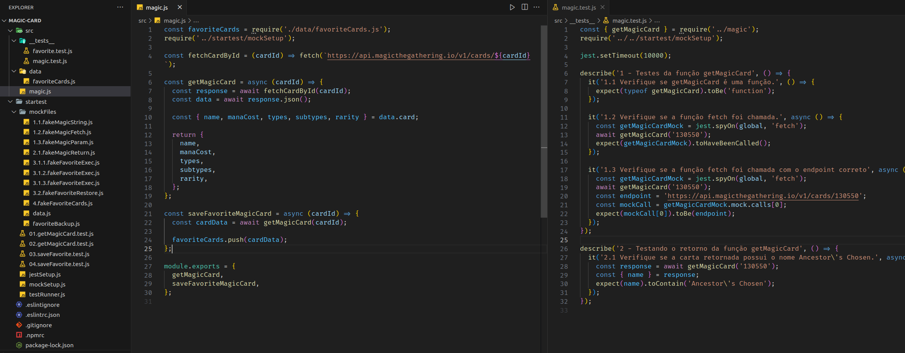

# README: Magic card



## Project Description

The project involved fetching data from a Magic: The Gathering API. I had to test its functions using Jest

### Technologies

- LINUX
- VSCODE
- JAVASCRIPT
- JEST

### What I Learned

- How to use spys on jest tests
- How to mock API returns

## How to Run the Project

1. Clone the repository:

   ```bash
   git clone https://github.com/feduarte-dev/zoo-functions
   ```

2. Navigate to the project directory:

   ```bash
   cd your-repository
   ```

3. Install dependencies:

   ```bash
   npm install
   ```

4. Test the application:

   ```bash
   npm run test
   ```

## Contributions

[Felipe](https://www.linkedin.com/in/feduarte-dev/) -  __ /tests __


[Trybe](https://www.betrybe.com/) - Everything else
